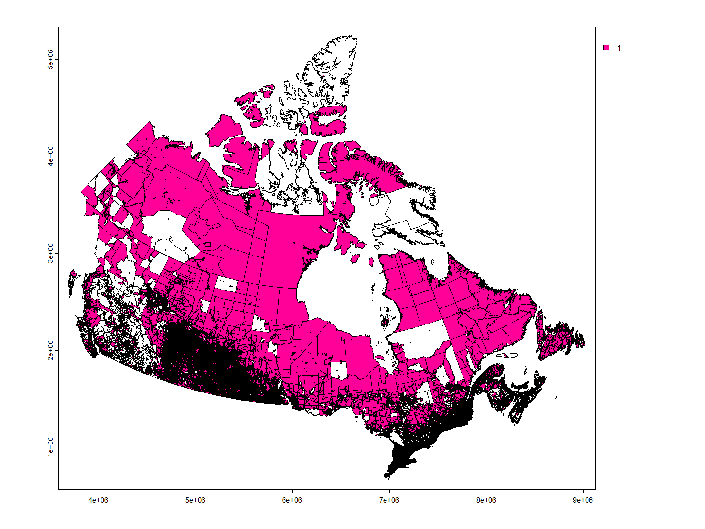
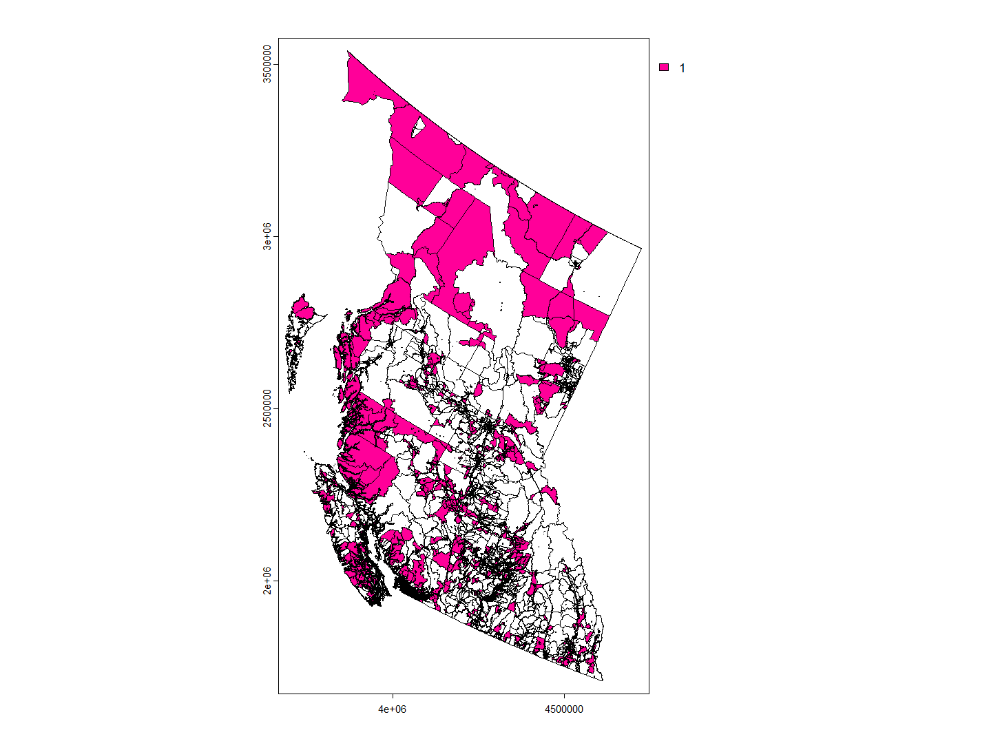
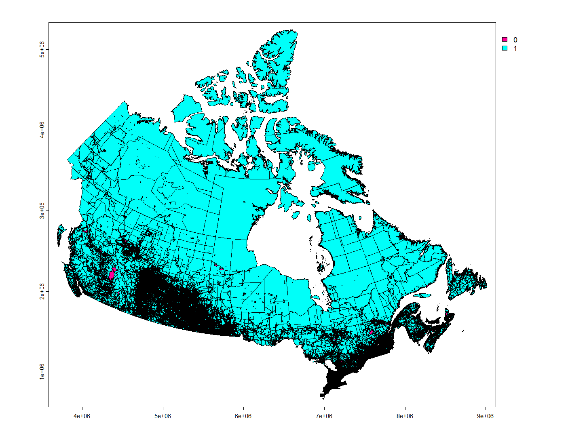

```{r setup, include=FALSE}
knitr::opts_chunk$set(echo = F, 
                      cache = T, 
                      message = F, 
                      warning = F, 
                      fig.align="center", fig.width=8, fig.height=6)
library(dplyr)
# library(factoextra)
library(ggplot2)
library(tidyverse)
# library(gridExtra)
library(knitr)
library(kableExtra)
```

<!-- ## Outline
- Overall summary: how many variables, how many missing values

- Exploring missing values: are they related to population?

- Exploring data distributions

- Population zero 
-->

## Import Data

### Import PMD data

Glimpse of PMD dataset

```{r}
pmd <- read.csv("../../../local_data/pmd-en.csv")
head(pmd, 3)
```

## DATA Summary

```{r eval=FALSE}
# no. of rows and columns
dim(pmd)
```

Structure of the dataset

```{r}
str(pmd)
```

There are 489,676 rows in this data and 41 columns, meaning that 489,676 dissemination blocks are included. The 41 columns include information about the dissemination blocks themselves such as ID, population, and coordinates, as well as information about other census boundaries like dissemination areas, census areas, and provinces. Each of the 10 amenities have two columns associated with it: one a binary indicator to track whether the amenity is present in the DB itself, and the other the calculated proximity measure. Finally there are three indicators: transit_na, amenity_dense, and suppressed.

```{r echo=TRUE}
length(unique(pmd$DBUID))
```

There are no duplicate rows as the number of unique dissemination block id is same as the number of rows in the dataset.

There are some features which are currently in character type but needs to be numeric such as proximity indices, population. Will convert these features datatypes.

```{r echo=FALSE}
# Convert selected columns to numeric
pmd <- pmd %>%
  mutate(DBPOP = as.numeric(gsub(",", "", DBPOP)), # Dissemination block population
         DAPOP = as.numeric(gsub(",", "", DAPOP)), # Dissemination area population
         CSDPOP = as.numeric(gsub(",", "", CSDPOP)), # Census subdivision population
         CMAPOP = as.numeric(gsub(",", "", CMAPOP)), # Census metropolitan area population
         PRPOP = as.numeric(gsub(",", "", PRPOP)), # Province or territory population
         # in_db_emp = as.numeric(in_db_emp),
         # in_db_pharma = as.numeric(in_db_pharma),
         # in_db_childcare = as.numeric(in_db_childcare),
         # in_db_health = as.numeric(in_db_health),
         # in_db_grocery = as.numeric(in_db_grocery),
         # in_db_educpri = as.numeric(in_db_educpri),
         # in_db_educsec = as.numeric(in_db_educsec),
         # in_db_lib = as.numeric(in_db_lib),
         # in_db_parks = as.numeric(in_db_parks),
         # in_db_transit = as.numeric(in_db_transit),
         prox_idx_emp = as.numeric(prox_idx_emp),
         prox_idx_pharma = as.numeric(prox_idx_pharma),
         prox_idx_childcare = as.numeric(prox_idx_childcare),
         prox_idx_health = as.numeric(prox_idx_health),
         prox_idx_grocery = as.numeric(prox_idx_grocery),
         prox_idx_educpri = as.numeric(prox_idx_educpri),
         prox_idx_educsec = as.numeric(prox_idx_educsec),
         prox_idx_lib = as.numeric(prox_idx_lib),
         prox_idx_parks = as.numeric(prox_idx_parks),
         prox_idx_transit = as.numeric(prox_idx_transit),
         DBUID = as.character(DBUID),
         DAUID = as.character(DAUID),
         CSDUID = as.character(CSDUID),
         CMAUID = as.character(CMAUID),
         CMAPUID = as.character(CMAPUID),
         PRUID = as.character(PRUID),
         suppressed = as.character(suppressed),
         transit_na = as.character(suppressed))
```

Summary of the dataset

```{r}
# summary of the dataset
# sapply(pmd, function(x) if(is.numeric(x)) summary(x))

# Summary of data set
pmd_tibble <- as_tibble(Filter(is.numeric, pmd))
# sapply(Filter(is.numeric, pmd), summary) %>% kable() %>% kable_styling()
summary(pmd_tibble) %>% kable() %>% kable_styling()
```

```{r eval=FALSE}
unique(pmd$PRNAME)
```

```{r}
pmd$PRNAME <- gsub("Newfoundland and Labrador / Terre-Neuve-et-Labrador", "Newfoundland and Labrador", pmd$PRNAME)
pmd$PRNAME <- gsub("Prince Edward Island / Île-du-Prince-Édouard", "Prince Edward Island", pmd$PRNAME)
pmd$PRNAME <- gsub("Nova Scotia / Nouvelle-Écosse", "Nova Scotia", pmd$PRNAME)
pmd$PRNAME <- gsub("New Brunswick / Nouveau-Brunswick", "New Brunswick", pmd$PRNAME)
pmd$PRNAME <- gsub("Quebec / Québec", "Quebec", pmd$PRNAME)
pmd$PRNAME <- gsub("British Columbia / Colombie-Britannique", "British Columbia", pmd$PRNAME)
pmd$PRNAME <- gsub("Northwest Territories / Territoires du Nord-Ouest", "Northwest Territories", pmd$PRNAME)
```


## Missing Values

### Missing values percentage

```{r}
# percentage of missing values in each column in dataset
p <- function(x) {sum(is.na(x))/length(x)*100}
sort(apply(pmd, 2, p), decreasing = TRUE) %>% kable() %>% kable_styling()
```

In glimpse of dataset we saw there were missing values in `prox_idx_lib` but the above output suggest there is no missing values. Because Statistics Canada use some specific notation for missing values. The following standard symbols are used in Statistics Canada publications:  
$.. ->$ not available for a specific reference period  
$F ->$ to unreliable to be published
By changing these symbols to NA missing percentages are

```{r}
pmd[pmd == ".." | pmd == "F"] <- NA
```

```{r}
# getting proportions of nas
na_prop <- function(x) {sum(is.na(x))/length(x)*100}
sort(apply(pmd, 2, na_prop), decreasing = T) %>% kable() %>% kable_styling()
```

We can see that the library proximity indicator contains the most missing values, almost 77%, followed by the proximity measures for grocery and secondary education. Only two out of the ten amenities have proximity measures missing proportion under 50%: health and employment. 

### All proximity measures are NA

```{r}
# Subset columns that start with "prox_idx"
prox_cols <- colnames(pmd)[grepl("^prox_idx", colnames(pmd))]

# Check if there are any dbs where all proximity measures are missing
all_prox_na <- pmd[rowSums(is.na(pmd[,prox_cols])) == length(prox_cols), ]
cat("No. of rows: All proximity measures are NA", nrow(all_prox_na))
```

So, there are 64764 dissemination blocks where none of the proximity measures are available. Let's check the population of those dissemination blocks.

```{r echo=TRUE}
unique(all_prox_na$DBPOP)[1:5]
sort(unique(all_prox_na$DBPOP), decreasing = TRUE)[1:5]
```

There are DB's with large population that has no proximity measures. The aminities might be not in range that's why its not calculated.


## Distributions

#### Dissemination block per province.

```{r}
# Count the number dbs' that fall under each province
db_counts <- pmd %>% count(prov = pmd$PRNAME)

# Order the levels of prov based on count values
db_counts$prov <- factor(db_counts$prov, levels = db_counts$prov[order(db_counts$n, decreasing = TRUE)])

# Create bar chart
ggplot(db_counts, aes(x = prov, y = n)) +
  geom_bar(stat = "identity", fill = "steelblue") +
  geom_text(aes(label = n), vjust = -0.5, color = "black", size = 3.5) +
  labs(title = "Number of DBs' per Province",
       x = "Province",
       y = "No. of DBs'") +
  theme(axis.text.x = element_text(angle = 45, hjust = 1))
```

#### Population per Province

```{r}
unique_population <- unique(pmd[, c("PRNAME", "PRPOP")])

# Order the dataframe in decreasing order of PRPOP
unique_population <- unique_population[order(unique_population$PRPOP, decreasing = TRUE), ]

# Set PRNAME as a factor with levels in the desired order
unique_population$PRNAME <- factor(unique_population$PRNAME, levels = unique_population$PRNAME)

# Create the bar plot
ggplot(unique_population, aes(x = PRNAME, y = PRPOP)) +
  geom_bar(stat = "identity", fill = "steelblue") +
  geom_text(aes(label = PRPOP), vjust = -0.5, color = "black", size = 3.5) +
  labs(title = "Population by Province",
       x = "Province",
       y = "Population") +
  theme(axis.text.x = element_text(angle = 45, hjust = 1))
```

There's a large population gap between BC and Saskatchewan but both has approximately same no. of DBs'.


#### Proportion of missing values for each amenity by province.

```{r fig.height=10, fig.width=12}
# Getting infos from data 
num_prox_cols <- grep("prox", colnames(pmd)) # column numbers of proximity measures
prov_code <- unique(pmd$PRUID) # province codes
prov_name <- unique(pmd$PRNAME) # province abbreviations


#initialize a matrix and empty list
mat_missing = matrix(data=NA, ncol=length(num_prox_cols), nrow=length(prov_code))
amt_rows <- c()

# Making a matrix of amenities x provinces, percentage missing values
for (i in 1:length(prov_code)){
  # get the number of rows for each province
  amt_rows[i] <- nrow(filter(pmd, pmd$PRUID == prov_code[i]))
  for (j in 1:length(num_prox_cols)){
    # for every province, iterate through every amenity and get percentage missing
    amt_miss <- nrow(filter(pmd, is.na(pmd[,num_prox_cols[j]]) & pmd$PRUID == prov_code[i]))
    mat_missing[i,j] <- amt_miss/amt_rows[i]
  }
}

# build dataframe, rename columns and rows
df_perc_missing <- mat_missing %>% data.frame() %>% setNames(prox_cols)
rownames(df_perc_missing) <- prov_name

df_perc_missing <- cbind(prov_name, df_perc_missing)

#df_perc_missing

# flattening so can facet
df_perc_missing %>% pivot_longer(all_of(prox_cols)) %>%
  ggplot(aes(y = value, x = prov_name, fill = prov_name)) + 
  geom_col() + 
  facet_wrap(~name, ncol = 2) + 
  labs(title = "Missing values for each province by amenity") +
  theme(axis.title.x = element_blank(),
          axis.title.y = element_blank(),
          axis.text.x = element_blank(),
          axis.ticks.x = element_blank())
```

We see that overall, employment has the lowest rates of missing values, but has also more range depending on the province. Ontario and Quebec seems to have the least missing values for most amenities relative to the other regions, whereas Nunavut usually has the most. It seems like the amount of proximity measure missing for libraries are the most consistent across regions. 

#### Violin plots of Proximity Measures

We can take a preliminary look at the distribution of proximity measures for each amenity, to see if there are 'obvious' clusters.

```{r}
# manipulate dataframe to only keep amenities cols
df_violin <- subset(pmd, select = prox_cols)
# rename cols for easier plot reading
names(df_violin) <- sub('prox_idx_', '', names(df_violin))
prox_cols_short <- names(df_violin)
# pivot to long to make work with plots
df_violin_long <- pivot_longer(df_violin, all_of(prox_cols_short))
```

```{r fig.height= 4, fig.width=6}
ggplot(df_violin_long, aes(x=name, y = value)) + geom_violin() + labs(x = "Amenity", title = "Distribution of proximity measures by amenity")
```

In this violin plot, we see that the highest densities of proximity values lie below 0.12 for all amenities. We see that the amenities with the highest distribution density closer to 0 are health, then employment, then transit. Library has the lowest density right around zero, and 'starts' a bit later. Health and employment have the least amount of missing values, and library has the most; some conclusion could be made out of that. 

#### Kernel Density plots of Proximity Measures

Next we see the kernel densities of proximity measures for each amenity.

```{r fig.height=10, fig.width=6}
# kernel density plots
ggplot(df, aes(x = value, fill = variable)) +
  geom_density(alpha = 0.5) +
  xlab("Value") +
  ylab("Density") +
  ggtitle("Density plots of proximity indices") +
  theme(axis.text.x = element_text(angle = 45, hjust = 1)) +
  facet_wrap(~variable, scales = 'free_y', nrow = 5)
```

We see that most curves appear smooth, but some like for primary education, secondary education, and library, have 'bumps', which could indicate clusters. Overall, the naked eye is not able to perceive obvious segmentation cutoffs.

Kernel density plot of prox_idx_health by provinces

```{r fig.height=10, fig.width=6}
# prox_idx_health distribution province wise
ggplot(pmd, aes(x = prox_idx_emp, fill = PRNAME)) +
  geom_density(alpha = 0.5) +
  xlab("Value") +
  ylab("Density") +
  ggtitle("prox_idx_health distribution province wise") +
  theme(axis.text.x = element_text(angle = 45, hjust = 1)) +
  facet_wrap(~PRNAME, scales = 'free_y', nrow = 5)
```

prox_idx_emp distribution csdtype wise

```{r}
# prox_idx_emp distribution csdtype wise
ggplot(data = pmd, aes(x = CSDTYPE, y = prox_idx_emp)) +
  geom_boxplot() +
  xlab("CSDTYPE") +
  ylab("prox_idx_emp") +
  ggtitle("prox_idx_emp distribution csdtype wise") +
  theme(axis.text.x = element_text(angle = 45, hjust = 1))
```

On average, the proximity of employees is lower in most of the CSDs. However, cities, towns, and district municipalities have higher average proximity measures of employee. This observation is understandable as these areas tend to offer more job opportunities.

#### Distribution of amenitie_dense

```{r dev ="png", dpi = 300}
ggplot(pmd, aes(x=as.factor(amenity_dense) )) +
  geom_bar(width=0.7, fill="steelblue") +
  geom_text(stat="count", aes(label=..count..), vjust=-0.5) +
  labs(x = "Amenity Dense")
```

37303 DBs' are in an amenity dense neighbourhood, 
4827 DBs' are in a high amenity density neighbourhood, 
442179 DBs' are in a non-amenity dense neighbourhood.

#### Population zero

```{r eval=FALSE}
# how many DB have population of 0
nrow(filter(pmd, pmd$DBPOP == 0))/nrow(pmd)
```

About 24% of the DBs in Canada (in 2016) have a population of 0. It could be reasonable to expect that if the population of a DB is 0, then the proximity measure are also near 0: it is intuitive that for the most part, amenities are further away from areas with no populations. It is thus reasonable to explore the cases where the population is zero, to see its prevalence, and deduce how it may affect the values of proximity measures. In the appendix there's a barplot showing how many DBs there are per province: Ontario and Quebec have the most, whereas the Territories have the least. 

DBs with a population of zero by Province

```{r}
PRNAME <- unique(pmd$PRNAME)

pmd %>% filter(DBPOP == 0) %>% 
  ggplot(aes(PRNAME)) + 
  geom_bar(fill="steelblue") + 
  labs(x = "",
    title = "How many DBs with population zero by province") +
  geom_text(stat="count", aes(label=..count..), vjust=-0.5) +
  theme(axis.text.x = element_text(angle = 45, hjust = 1))

#cowplot::plot_grid(p1,p2)
```

Here, we can see that the province with the most DBs with a population of zero is Saskatchewan, followed by Ontario, Quebec, and Alberta. 

Proportion of population zero DBs' by province

```{r}
# should get proportions
data.frame(table(filter(pmd, pmd$DBPOP == 0)$PRNAME)/table(pmd$PRNAME)) %>% ggplot(aes(factor(Var1), Freq)) + 
  geom_col(fill="steelblue") + 
  labs(x = "",
    title = "Proportion of population zero DBs' by province") +
  geom_text(aes(label= round(Freq, 3)), vjust=-0.5) +
  theme(axis.text.x = element_text(angle = 45, hjust = 1))
```

Taking the proportions however, we see that over 50% of Yukon and NWT's DBs have a population of 0, and Saskatchewan has over 40%. Ontario has the lowest at around 15%, followed by Quebec at around 18%.

DB counts of zero populations by CSDTYPE

```{r}
sort(table(filter(pmd, pmd$DBPOP == 0)$CSDTYPE), decreasing = T)
```

We see that the CSDTYPE with the most populations = zero are rural municipalities followed relatively closely by cities. It seems the majority of the top counts are urban areas (cities, villes, municipalities, etc), which is somewhat unexpected.

DBs' by Province where all PMS NA

```{r}
# Count the occurrences of each CSDTYPE value
pr_counts <- data.frame(table(all_prox_na$PRNAME))

# Create a bar plot
ggplot(data = pr_counts,
       aes(x = Var1, y = Freq)) +
  geom_bar(stat = "identity", fill="steelblue") +
  geom_text(aes(label = Freq), vjust = -0.5) +
  labs(title = "Number of DBs' by Province where all PMS NA") +
  xlab("Province") +
  ylab("Count") +
  theme(axis.text.x = element_text(angle = 45, hjust = 1))
```

DBs' by CSDTYPE where all PMS NA

```{r}
# Count the occurrences of each CSDTYPE value
csdtype_counts <- data.frame(table(all_prox_na$CSDTYPE))

# Create a bar plot
ggplot(data = csdtype_counts,
       aes(x = Var1, y = Freq)) +
  geom_bar(stat = "identity", fill="steelblue") +
  # geom_text(aes(label = Freq), vjust = -0.5) +
  labs(title = "Number of DBs' by CSDTYPE where all PMS NA") +
  xlab("CSDTYPE") +
  ylab("Count") +
  theme(axis.text.x = element_text(angle = 45, hjust = 1))
```

We can see that These DBs are from different province and different csd. If we can plot them on map then it may make sense!
Majority portions of db where all proximity measures are null from Regional municipality and Municipal district.

DBs' for which all the proximity measures of amenities are 0

```{r echo=TRUE}
# Check if there are any dbs where all proximity measures are 0
all_prox_0 <- pmd[rowSums(pmd[, prox_cols] == 0, na.rm = TRUE) == length(prox_cols), ]
nrow(all_prox_0)
```

There are no dissemination blocks for which all the proximity measures of amenities are 0. So, dissemination blocks with no populations still has the proximity measures of amenities may be those dissemination blocks are close from other populated dissemination blocks, or the dissemination blocks contain parks, office buildings, industrial area, under construction etc.

DBs with population NA by province

```{r}
pmd %>% filter(is.na(pmd$DBPOP)) %>% 
  ggplot(aes(factor(PRNAME))) + 
  geom_bar(fill="steelblue") + 
  labs(x = "",
    title = "DBs with population NA by province") + 
  geom_text(stat="count", aes(label=..count..), vjust=-0.5) +
  theme(axis.text.x = element_text(angle = 45, hjust = 1))
```

Some of the population is NA. We see that Quebec has the most DBs with a population NA, followed by Ontario, Alberta, and BC. 

```{r eval=F}
table(filter(pmd, is.na(DBPOP))$CSDTYPE)
```

The CSDTYPE of the DB's whose population information is NA are IRI – Indian reserve and S-É – Indian settlement.

#### Effect of removing population = 0

```{r}
# Data wrangling
# keeping only vals not 0
pop_0 <- filter(pmd, pmd$DBPOP !=0)
names(pop_0) <- sub('prox_idx_', '', names(pop_0))
# manipulate dataframe to only keep amenities cols
df_man_pop <- subset(pop_0, select = prox_cols_short)

# pivot to long to make work with plots
df_long_pop <- pivot_longer(df_man_pop, all_of(prox_cols_short))

# if only keep population ==0
pop_only0 <- filter(pmd, pmd$DBPOP ==0)
names(pop_only0) <- sub('prox_idx_', '', names(pop_only0))
# manipulate dataframe to only keep amenities cols
df_man_pop_only <- subset(pop_only0, select = prox_cols_short)

# pivot to long to make work with plots
df_long_pop_only <- pivot_longer(df_man_pop_only, all_of(prox_cols_short))
```


```{r fig.height=10, fig.width=6}
# data wrangling
# add row indicating what data type
which_df <- rep("all", nrow(df_violin_long))
df_violin_long <- cbind(df_violin_long, which_df)
which_df <- rep("red", nrow(df_long_pop))
df_long_pop <- cbind(df_long_pop, which_df)
which_df <- rep("pop0", nrow(df_long_pop_only))
df_long_pop_only <- cbind(df_long_pop_only, which_df)

# merge df together
df_long_both <- rbind(df_violin_long, df_long_pop)
df_long_red <- rbind(df_long_pop, df_long_pop_only)
```


The null hypothesis of the Kolmogorov-Smirnov test is that the two samples come from the same distribution. In this following table, we compare the 'sample' where the population = 0 vs the rest. We see that the p-values are very small for every amenity, thus leading us to conclude that we have sufficient evidence to say that these 'samples' don't come from the same distribution. (We can conclude that there is an effect on the proximity measures when the population is 0 ?)

```{r}
amen_pval <-c()
n = 0
for (amen in prox_cols_short){
  n = n+1
  amen_pval[n]<- ks.test(filter(df_long_pop_only, df_long_pop_only$name == amen)$value, filter(df_long_pop, df_long_pop$name == amen)$value)[["p.value"]]
}

amen_pvaldf_red <- cbind(prox_cols_short,amen_pval)
amen_pvaldf_red
```
But in what ways do these subsets differ?

Here we are comparing the histogram for both, where the pink represents the count of population = 0, and the blue the rest. We see that the 'pink' appears to mirror the trends of the 'blue', but on a smaller scale. In the appendix, a 'zoomed in' plot is available. Surprisingly, see there that for some higher proximity 'bins' in transit and health, there are more cases for when population = 0. We also see in the appendix the kernel densities. 


```{r fig.height=10, fig.width=6}
# histograms
ggplot(df_long_red, aes(value, fill = which_df)) + 
    geom_histogram(bins = 50, alpha = .5, position="identity") + 
    facet_wrap(~name, scales = 'free_y', ncol = 2)
```

From this following table, we see that 72% of the proximity measure values where population = 0 are NA, compared to 50% of those where population !=0. 

```{r}
table(df_long_red$which_df,is.na(df_long_red$value))/cbind(table(df_long_red$which_df), table(df_long_red$which_df))
```

### Outliers

Outliers can have a significant impact on the clustering results by pulling the centroids towards themselves, creating biased clusters, and reducing the effectiveness of the clustering algorithm.

Boxplots of proximity indices

```{r}
# Create a melted data frame for the boxplot
df <- reshape2::melt(pmd[, prox_cols])

# Create the boxplot
ggplot(df, aes(x = variable, y = value)) +
  geom_boxplot() +
  xlab("") +
  ylab("Value") +
  ggtitle("Boxplots of proximity indices") +
  theme(axis.text.x = element_text(angle = 45, hjust = 1))
```

Boxplot of prox_idx_childcare with outlier indication

```{r}
# Calculate Q1 and IQR
Q1 <- quantile(df$value[df$variable == "prox_idx_childcare"], 0.25, na.rm = TRUE)
Q3 <- quantile(df$value[df$variable == "prox_idx_childcare"], 0.75, na.rm = TRUE)
IQR <- IQR(df$value[df$variable == "prox_idx_childcare"], na.rm = TRUE)

# Create the boxplot with the horizontal line
ggplot(df[df$variable == "prox_idx_childcare", ], aes(x = variable, y = value)) +
  geom_boxplot() +
  geom_hline(yintercept = Q1 - 1.5*IQR, linetype = "dashed", color = "red") +
  geom_hline(yintercept = Q3 + 1.5*IQR, linetype = "dashed", color = "red") +
  xlab("") +
  ylab("Value") +
  ggtitle("Boxplot of prox_idx_childcare") +
  theme(axis.text.x = element_text(angle = 45, hjust = 1))

```

Outliers distribution of prox_idx_childcare

```{r}
# Subset the data for the desired variable
variable_name <- "prox_idx_childcare"
data_subset <- df[df$variable == variable_name, ]

# Calculate the outliers based on the IQR method
Q1 <- quantile(data_subset$value, 0.25, na.rm = TRUE)
Q3 <- quantile(data_subset$value, 0.75, na.rm = TRUE)
IQR <- IQR(data_subset$value, na.rm = TRUE)
outliers <- data_subset$value[data_subset$value < Q1 - 1.5 * IQR | data_subset$value > Q3 + 1.5 * IQR]

# Remove NA values from outliers
outliers <- na.omit(outliers)

# Plot the histogram and boxplot
ggplot(data = data.frame(value = outliers), aes(x = value), color = "red", size = 3) +
  geom_density(alpha = 0.5) +
  labs(x = variable_name, y = "Frequency") +
  ggtitle(paste("Outliers distribution of", variable_name)) +
  theme_minimal()
```

Outliers distribution of prox_idx_emp

```{r}
# Subset the data for the desired variable
variable_name <- "prox_idx_emp"
data_subset <- df[df$variable == variable_name, ]

# Calculate the outliers based on the IQR method
Q1 <- quantile(data_subset$value, 0.25, na.rm = TRUE)
Q3 <- quantile(data_subset$value, 0.75, na.rm = TRUE)
IQR <- IQR(data_subset$value, na.rm = TRUE)
outliers <- data_subset$value[data_subset$value < Q1 - 1.5 * IQR | data_subset$value > Q3 + 1.5 * IQR]

# Remove NA values from outliers
outliers <- na.omit(outliers)

# Plot the histogram and boxplot
ggplot(data = data.frame(value = outliers), aes(x = value), color = "red", size = 3) +
  geom_density(alpha = 0.5) +
  labs(x = variable_name, y = "Frequency") +
  ggtitle(paste("Outliers distribution of", variable_name)) +
  theme_minimal()
```


```{r}
qqnorm(pmd$prox_idx_childcare, main = "Normal Q-Q plot")
```

It's hard to detect the outliers from Normal Q-Q plot. 

#### Rosner’s test for Outliers

Let's do the Rosner’s test. 

Rosner's test for multiple outliers is used by VSP to detect up to 10 outliers among the selected data values. This test will detect outliers that are either much smaller or much larger than the rest of the data. Rosner's approach is designed to avoid the problem of masking, where an outlier that is close in value to another outlier can go undetected.

Rosner's test is appropriate only when the data, excluding the suspected outliers, are approximately normally distributed, and when the sample size is greater than or equal to 25.
(https://vsp.pnnl.gov/help/vsample/rosners_outlier_test.htm)

Just to check we set k=5000, so it will look for 5000 outliers in the data.

```{r echo=TRUE}
# Rosner’s test
library(EnvStats)
test <- rosnerTest(pmd$prox_idx_emp, k = 5000, warn = TRUE)
```

```{r eval=FALSE}
test$all.stats
```

```{r echo=TRUE}
length(test$all.stats$Outlier == TRUE)
```

As in the resnor's test output we find 5000 outlier so there might be more in our data. It's a proof that there are too many outliers in the data.

#### Chi-squared test  for Outliers

```{r echo=TRUE}
library(outliers)
chisq.out.test(pmd$prox_idx_emp)
```

So the max proximity measure of grocery is an outlier.

```{r echo=TRUE}
chisq.out.test(pmd$prox_idx_emp, opposite = TRUE)
```

So the min proximity measure of grocery is an outlier.

The proximity measures are already normalized but we can still see outliers in these. So, we should use clustering algorithms that can handle outliers.  
For example DBSCAN clustering is robust against outliers when we choose minimum number of points (minPts) - (a threshold) large enough.  
Ordering points to identify the clustering structure (OPTICS) is an algorithm for finding density-based clusters in spatial data which is also robust against outliers.  
https://en.wikipedia.org/wiki/OPTICS_algorithm#cite_note-1
But we can't use general k-means: the squared error approach is sensitive to outliers. But there are variants such as k-medians for handling outliers.  
(https://www.researchgate.net/publication/220490566_A_review_of_robust_clustering_methods)

Another approach is to apply a transformation to the data that can reduce the impact of outliers. For example, we could apply a log transformation or a power transformation to the data. These transformations can help to reduce the influence of extreme values and make the data more symmetric.

## Conclusion

There are no obvious clusters in the proximity measures to the naked eye.

The distribution of missing values is not the same across amenities nor provinces. 

Our dataset contains a lot of rows, and there may be question about the 'usefulness' of all of them. If we were to remove all the DBs where the population is 0, we could reduce our dataset by 23%, aiding computationally. There are still proximity measures associated with these DBs with population 0: the distributions of their proximity measures are not the statistically the same as those for the rest of the DBs (those with populations), but the trends appear somewhat similar. 

It doesn't appear that population of a DB is the only factor affecting whether a proximity measure is missing (NA); it was the only one tested as it was the only one included in this dataset. According to StatsCan's definition of a DB however, "only population and dwelling counts are disseminated at the dissemination block level" anyways. If we wanted to analyse other factors, we would have to look into aggregation at a higher level, which is not straighforward (need to take the mean/etc of whether something is missing or not?). 

### Correlation

```{r}
library(corrplot)

M <- cor(pmd[prox_cols], use = "pairwise.complete.obs")
corrplot(M, type = "upper", order = "hclust",
         addCoef.col = "black",
         diag = FALSE)
```

```{r}
corrplot(M, type = "upper", 
         addCoef.col = "black", method = "ellipse",
         diag = FALSE)
```


\newpage


For each amenity, we can plot the occurrence of missing values in a DB vs its population, and plot a basic logistics curve. The employment curve is included below, and the remainder are found in the appendix. We see that for some amenities, like employment and health, the missing values are concentrated among DBs with small populations. These are the same amenities with less than 50% of values missing. Overall it seems like the population of the DB is not the only factor, if at all, affecting whether a proximity measure is missing for that DB.

```{r}
# convert data so NA = 1, other = 0
df_na <- pmd

# converting all values to 0 and all na to 1 for amenities cols
df_na[prox_cols][!is.na(df_na[prox_cols])] <- 0
df_na[prox_cols][is.na(df_na[prox_cols])] <- 1
```

```{r fig.height=3, fig.width=6}
# plot logistics curve for amenity and population
# couldn't figure out easy way to get it; for loops weren't working, and facet involves flattening but I wanted to keep most of the info incase I needed it
#par(mfrow = c(2,5))
ggplot(df_na, aes(x=DBPOP, y=prox_idx_emp)) + 
  geom_point(alpha=.5) +
  stat_smooth(method="glm", se=FALSE, method.args = list(family=binomial)) + labs(title = "Logistic regression curve (1-NA) vs population")

```


We can also plot the histograms of missing values vs populations for each amenity, where '1' (blue) is a missing value and '0' (pink) is a value not missing. Again, the remainder are found in the appendix.

```{r fig.height=4, fig.width=6}
# I should really just facet it
par(mfrow = c(5,2))
ggplot(df_na) +
  geom_histogram(aes(x=DBPOP, fill=factor(prox_idx_emp)), bins = 40,
                 colour="grey50", alpha=0.5, position="identity") + labs(title = "Histogram NA values vs rest by population for employment")
```

Overall, there are more DBs with lower populations than larger populations. We see that for some amenities, at smaller populations, there are a lot more missing values. Again, employment and health are the only two where there are always more actual values than missing values at every population bin. 

```{r eval = F}
# ### Model with other variables to see relationship: need add 'master' df
# basic model with only population
log_mod <- glm(prox_idx_emp~DBPOP, data = df_na)
summary(log_mod)
# diagnostics
plot(log_mod)
```


### Spat

```{r eval=FALSE, echo=FALSE}
library(terra)
db_shp <- vect("../../../local_data/boundary/ldb_000b16a_e.dbf")
db_shp
```

```{r eval=FALSE, echo=FALSE}
plot(db_shp, "DBUID")
```

DB plot on Map of Canada


```{r eval=FALSE, echo=FALSE}
db_shp_temp <- db_shp
```

```{r eval=FALSE, echo=FALSE}
# make a new column for marking on map
all_prox_na$prox_na <- 1
```

```{r eval=FALSE, echo=FALSE}
# Merge DBUID column from all_prox_na to db_shp
all_prox <- all_prox_na %>% rename(DBID = DBUID)
all_prox <- all_prox[order(all_prox$DBID), ]
db_shp_temp <- merge(db_shp_temp, all_prox, by.x = c("DBUID"), by.y = c("DBID"), all.x = TRUE)
```

Marked DBs where all proximity measures are null.

```{r eval=FALSE, echo=FALSE, dev = "png", dpi = 300}
plot(db_shp_temp, "prox_na")
```



So where all proximity measures are missing are not randomly distributed. We have seen before that these areas have population. But our main target is to cluster the proximity measures. As all the proximity measures are missing here we can delete these rows from our database then do the clustering and also we can do clustering by keeping them aswell and see the difference.

Closer look to all null proximity measures of BC.

```{r eval=FALSE, echo=FALSE}
# closer look to bc
i <- which(db_shp_temp$PRUID.x == 59)
pa_bc <- db_shp_temp[i,]
```

```{r eval=FALSE, echo=FALSE}
pa_bc
```


```{r eval=FALSE, echo=FALSE}
plot(pa_bc, "prox_na")
```



Closer look to all null proximity measures of Alberta.

```{r eval=FALSE, echo=FALSE}
# closer look to bc
i <- which(db_shp_temp$PRUID.x == 48)
pa_alberta <- db_shp_temp[i,]
```

```{r eval=FALSE, echo=FALSE}
plot(pa_alberta, "prox_na")
```


Now let's look at the proximity measures na values aminity wise.

```{r eval=FALSE, echo=FALSE}
pmd_temp <- pmd
```

```{r eval=FALSE, echo=FALSE}
#prox_cols <- colnames(pmd)[grepl("^prox_idx", colnames(pmd))]

# Create a new column for each prox_col indicating if the value is missing
for (col in prox_cols) {
  pmd_temp[[paste0("prox_na_", col)]] <- ifelse(is.na(pmd_temp[[col]]), 1, 0)
}
```


```{r eval=FALSE, echo=FALSE}
# Subset the resulting columns
prox_na_cols <- colnames(pmd_temp)[grepl("^prox_na", colnames(pmd_temp))]
pmd_prox_na <- pmd_temp[, c("DBUID", prox_na_cols)]
```

```{r eval=FALSE, echo=FALSE,}
db_shp_temp <- db_shp
```

```{r eval=FALSE, echo=FALSE,}
# Merge DBUID column from pmd_prox_na to db_shp
pmd_prox <- pmd_prox_na %>% rename(DBID = DBUID)
pmd_prox <- pmd_prox[order(pmd_prox$DBID), ]
db_shp_temp <- merge(db_shp_temp, pmd_prox, by.x = c("DBUID"), by.y = c("DBID"), all.x = TRUE)
```

Let's look where grocery proximity measures are missing all over Canada.

```{r eval=FALSE, echo=FALSE, dev = "png", dpi = 300}
plot(db_shp_temp, "prox_na_prox_idx_grocery")
```



Closer look to null grocery proximity measures of BC	

```{r eval=FALSE, echo=FALSE}
# closer look to bc
i <- which(db_shp_temp$PRUID == 59)
pa_bc <- db_shp_temp[i,]
```

```{r eval=FALSE, echo=FALSE}
plot(pa_bc, "prox_na_prox_idx_grocery")
```


```{r}
# Count NAs and non-NAs in the grocery column where province is BC
cat("No. of DBs in BC which prox_idx_grocery is NA",
    sum(is.na(pmd$prox_idx_grocery[pmd$PRUID == 59])), "\n")
cat("No. of DBs in BC which prox_idx_grocery is not NA", 
    sum(!is.na(pmd$prox_idx_grocery[pmd$PRUID == 59])))
```

\clearpage

# Appendix

```{r}
ggplot(pmd, aes(DBPOP)) + 
    geom_density()+labs(title = "Kernel density of DB population")
```

```{r fig.height=10, fig.width=12}
# Missing values for amennity by prov
# flattening so can facet
df_perc_missing %>% pivot_longer(all_of(prox_cols)) %>%
  ggplot(aes(y = value, x = name, fill = name)) + 
    geom_col() + 
    facet_wrap(~prov_name, ncol = 2) + labs(title = "Missing values for each amenity by province")
```

```{r}
# how many DBs by province
ggplot(pmd, aes(PRNAME)) + geom_bar() + labs(title = "How many DBs by province")
```
## Logistics curves NAs

```{r fig.height=3, fig.width=3}
ggplot(df_na, aes(x=DBPOP, y=prox_idx_pharma)) + 
  geom_point(alpha=.5) +
  stat_smooth(method="glm", se=FALSE, method.args = list(family=binomial))
ggplot(df_na, aes(x=DBPOP, y=prox_idx_childcare)) + 
  geom_point(alpha=.5) +
  stat_smooth(method="glm", se=FALSE, method.args = list(family=binomial))
ggplot(df_na, aes(x=DBPOP, y=prox_idx_health)) + 
  geom_point(alpha=.5) +
  stat_smooth(method="glm", se=FALSE, method.args = list(family=binomial))
ggplot(df_na, aes(x=DBPOP, y=prox_idx_grocery)) + 
  geom_point(alpha=.5) +
  stat_smooth(method="glm", se=FALSE, method.args = list(family=binomial))
ggplot(df_na, aes(x=DBPOP, y=prox_idx_educpri)) + 
  geom_point(alpha=.5) +
  stat_smooth(method="glm", se=FALSE, method.args = list(family=binomial))
ggplot(df_na, aes(x=DBPOP, y=prox_idx_educsec)) + 
  geom_point(alpha=.5) +
  stat_smooth(method="glm", se=FALSE, method.args = list(family=binomial))
ggplot(df_na, aes(x=DBPOP, y=prox_idx_lib)) + 
  geom_point(alpha=.5) +
  stat_smooth(method="glm", se=FALSE, method.args = list(family=binomial))
ggplot(df_na, aes(x=DBPOP, y=prox_idx_parks)) + 
  geom_point(alpha=.5) +
  stat_smooth(method="glm", se=FALSE, method.args = list(family=binomial))
ggplot(df_na, aes(x=DBPOP, y=prox_idx_transit)) + 
  geom_point(alpha=.5) +
  stat_smooth(method="glm", se=FALSE, method.args = list(family=binomial))
```

## Histograms NAs

```{r fig.height=4, fig.width=6}
ggplot(df_na) +
  geom_histogram(aes(x=DBPOP, fill=factor(prox_idx_pharma)), bins = 40,
                 colour="grey50", alpha=0.5, position="identity")
ggplot(df_na) +
  geom_histogram(aes(x=DBPOP, fill=factor(prox_idx_childcare)), bins = 40,
                 colour="grey50", alpha=0.5, position="identity")
ggplot(df_na) +
  geom_histogram(aes(x=DBPOP, fill=factor(prox_idx_health)), bins = 40,
                 colour="grey50", alpha=0.5, position="identity")
ggplot(df_na) +
  geom_histogram(aes(x=DBPOP, fill=factor(prox_idx_grocery)), bins = 40,
                 colour="grey50", alpha=0.5, position="identity")
ggplot(df_na) +
  geom_histogram(aes(x=DBPOP, fill=factor(prox_idx_educpri)), bins = 40,
                 colour="grey50", alpha=0.5, position="identity")
ggplot(df_na) +
  geom_histogram(aes(x=DBPOP, fill=factor(prox_idx_educsec)), bins = 40,
                 colour="grey50", alpha=0.5, position="identity")
ggplot(df_na) +
  geom_histogram(aes(x=DBPOP, fill=factor(prox_idx_lib)), bins = 40,
                 colour="grey50", alpha=0.5, position="identity")
ggplot(df_na) +
  geom_histogram(aes(x=DBPOP, fill=factor(prox_idx_parks)), bins = 40,
                 colour="grey50", alpha=0.5, position="identity")
ggplot(df_na) +
  geom_histogram(aes(x=DBPOP, fill=factor(prox_idx_transit)), bins = 40,
                 colour="grey50", alpha=0.5, position="identity")
```

## Proximity measures histograms 

```{r fig.height=10, fig.width=6}
# histograms
# Next we see the histograms of proximity values for each amenity. This gives us an idea of the counts for each bin of values. We see that libraries have the least amount of proximity values that are near 0, but we saw above that they also had the greatest amount of missing values.
ggplot(df_long, aes(value)) + 
    geom_histogram(bins = 50) + 
    facet_wrap(~name, scales = 'free_y', ncol = 2)
```

## Proximity measures density zoomed in ? I think something is off
```{r fig.height=10, fig.width=6}
# kernel densities
ggplot(df_long, aes(value)) + 
    geom_density() + 
    facet_wrap(~name, scales = 'free_y', ncol = 2) + xlim(0.5,1)+ labs(title = "Distribution of proximity measures by amenity, zoomed in")
```
## Population 0

```{r fig.height= 4, fig.width=6, include = F}
# violin plot
ggplot(df_long_pop, aes(x=name, y = value)) + geom_violin()
```

```{r fig.height=10, fig.width=6}
# histograms
ggplot(df_long_red, aes(value, fill = which_df)) + 
    geom_histogram(bins = 50, alpha = .5, position="identity") + 
    facet_wrap(~name, scales = 'free_y', ncol = 2) +xlim(0.25,1) + labs(title = 'Histogram of Population = 0 vs != 0, zoomed in')
```


```{r fig.height=10, fig.width=6}
# histograms
ggplot(df_long_red, aes(value, fill = which_df)) + 
    geom_density( alpha = .5, position="identity") + 
    facet_wrap(~name, scales = 'free_y', ncol = 2) +xlim(0.25,1) + labs(title = 'Kernel density of Population = 0 vs != 0, zoomed in')
```

## Table of counts for populations and NAs

There are still many more DBs that have populations > 0:

```{r}
table(df_long_red$which_df,is.na(df_long_red$value))
```
