```{r setup, include=FALSE}
knitr::opts_chunk$set(echo = TRUE, 
                      cache=TRUE, 
                      fig.align="center", fig.width=8, fig.height=6,
                      warning=FALSE)
library(dplyr)
library(ggplot2)
```

### Import data

```{r}
pmd <- read.csv("../../data/pmd-en.csv")
head(pmd, 3)
```

### DATA Summary

```{r}
# no. of rows and columns
dim(pmd)
```

489676 rows and 41 columns

```{r}
# dataset summary
str(pmd)
```

```{r}
unique(pmd$PRNAME)
```

```{r}
pmd$PRNAME <- gsub("Newfoundland and Labrador / Terre-Neuve-et-Labrador", "Newfoundland and Labrador", pmd$PRNAME)
pmd$PRNAME <- gsub("Prince Edward Island / Île-du-Prince-Édouard", "Prince Edward Island", pmd$PRNAME)
pmd$PRNAME <- gsub("Nova Scotia / Nouvelle-Écosse", "Nova Scotia", pmd$PRNAME)
pmd$PRNAME <- gsub("New Brunswick / Nouveau-Brunswick", "New Brunswick", pmd$PRNAME)
pmd$PRNAME <- gsub("Quebec / Québec", "Quebec", pmd$PRNAME)
pmd$PRNAME <- gsub("British Columbia / Colombie-Britannique", "British Columbia", pmd$PRNAME)
pmd$PRNAME <- gsub("Northwest Territories / Territoires du Nord-Ouest", "Northwest Territories", pmd$PRNAME)
```

```{r}
# percentage of missing values in each column in dataset
p <- function(x) {sum(is.na(x))/length(x)*100}
sort(apply(pmd, 2, p), decreasing = TRUE) # marmin = 2 means function will be applied in each column 
```

In head of dataset we saw there were missing values in `prox_idx_lib` but the above output suggest there is no missing values. Because Statistics Canada use some specific notation for missing values. The following standard symbols are used in Statistics Canada publications:  
$.. ->$ not available for a specific reference period  
$F ->$ to unreliable to be published

```{r}
# percentage of missing values in each column
p <- function(x) {sum(x == ".." | x == "F")/length(x)*100}
sort(apply(pmd, 2, p), decreasing = TRUE)
```

```{r}
pmd[pmd == ".." | pmd == "F"] <- NA
```

Count the dissemination block per province.

```{r}
# Count the number dbs' that fall under each province
db_counts <- pmd %>% count(prov = pmd$PRNAME)

# Create bar chart
ggplot(db_counts, aes(x=prov, y=n)) +
  geom_bar(stat="identity", fill="steelblue") +
  geom_text(aes(label=n), vjust=-0.5, color="black", size=3.5) +
  labs(title = "Number of DBs' by Province",
       x = "Province",
       y = "No. of DBs'") +
  theme(axis.text.x = element_text(angle = 45, hjust = 1))
```


```{r echo=FALSE}
# Convert selected columns to numeric
pmd <- pmd %>%
  mutate(DBPOP = as.numeric(gsub(",", "", DBPOP)), # Dissemination block population
         DAPOP = as.numeric(gsub(",", "", DAPOP)), # Dissemination area population
         CSDPOP = as.numeric(gsub(",", "", CSDPOP)), # Census subdivision population
         CMAPOP = as.numeric(gsub(",", "", CMAPOP)), # Census metropolitan area population
         PRPOP = as.numeric(gsub(",", "", PRPOP)), # Province or territory population
         # in_db_emp = as.numeric(in_db_emp),
         # in_db_pharma = as.numeric(in_db_pharma),
         # in_db_childcare = as.numeric(in_db_childcare),
         # in_db_health = as.numeric(in_db_health),
         # in_db_grocery = as.numeric(in_db_grocery),
         # in_db_educpri = as.numeric(in_db_educpri),
         # in_db_educsec = as.numeric(in_db_educsec),
         # in_db_lib = as.numeric(in_db_lib),
         # in_db_parks = as.numeric(in_db_parks),
         # in_db_transit = as.numeric(in_db_transit),
         prox_idx_emp = as.numeric(prox_idx_emp),
         prox_idx_pharma = as.numeric(prox_idx_pharma),
         prox_idx_childcare = as.numeric(prox_idx_childcare),
         prox_idx_health = as.numeric(prox_idx_health),
         prox_idx_grocery = as.numeric(prox_idx_grocery),
         prox_idx_educpri = as.numeric(prox_idx_educpri),
         prox_idx_educsec = as.numeric(prox_idx_educsec),
         prox_idx_lib = as.numeric(prox_idx_lib),
         prox_idx_parks = as.numeric(prox_idx_parks),
         prox_idx_transit = as.numeric(prox_idx_transit),
         DBUID = as.character(DBUID),
         DAUID = as.character(DAUID),
         CSDUID = as.character(CSDUID),
         CMAUID = as.character(CMAUID),
         CMAPUID = as.character(CMAPUID),
         PRUID = as.character(PRUID),
         suppressed = as.character(suppressed),
         transit_na = as.character(suppressed))
```

```{r}
# summary of the dataset
# sapply(pmd, function(x) if(is.numeric(x)) summary(x))
sapply(Filter(is.numeric, pmd), summary)

```


```{r}
# Subset columns that start with "prox_idx"
prox_cols <- colnames(pmd)[grepl("^prox_idx", colnames(pmd))]

# Check if there are any dbs where all proximity measures are missing
all_prox_na <- pmd[rowSums(is.na(pmd[,prox_cols])) == length(prox_cols), ]
nrow(all_prox_na)
```
```{r}
head(all_prox_na[prox_cols], 3)
```

So, there are 64764 dissemination blocks where none of the proximity measures are available. Let's check the population of those dissemination blocks.

```{r}
unique(all_prox_na$DBPOP)[1:5]
sort(unique(all_prox_na$DBPOP), decreasing = TRUE)[1:5]
```
When the DBPOP is 0, it is understandable that there are no proximity measures because they might not have been calculated. However, even for DB populations with large values, there are missing values for proximity measures, which is not expected.

```{r}
unique(all_prox_na$PRNAME)[1:5]
```
```{r}
# Count the occurrences of each CSDTYPE value
pr_counts <- data.frame(table(all_prox_na$PRNAME))

# Create a bar plot
ggplot(data = pr_counts,
       aes(x = Var1, y = Freq)) +
  geom_bar(stat = "identity") +
  geom_text(aes(label = Freq), vjust = -0.5) +
  labs(title = "Number of DBs' by Province where all PMS NA") +
  xlab("Province") +
  ylab("Count") +
  theme(axis.text.x = element_text(angle = 45, hjust = 1))
```


```{r}
# Count the occurrences of each CSDTYPE value
csdtype_counts <- data.frame(table(all_prox_na$CSDTYPE))

# Create a bar plot
ggplot(data = csdtype_counts,
       aes(x = Var1, y = Freq)) +
  geom_bar(stat = "identity") +
  # geom_text(aes(label = Freq), vjust = -0.5) +
  labs(title = "Number of DBs' by CSDTYPE where all PMS NA") +
  xlab("CSDTYPE") +
  ylab("Count") +
  theme(axis.text.x = element_text(angle = 45, hjust = 1))
```


We can see that These DBs are from different province and different csd. If we can plot them on map then it may make sense!
Majority portions of db where all proximity measures are null from Regional municipality and Municipal district.

```{r}
# Check if there are any dbs where all proximity measures are 0
all_prox_0 <- pmd[rowSums(pmd[, prox_cols] == 0, na.rm = TRUE) == length(prox_cols), ]
nrow(all_prox_0)
```

There are no dissemination blocks for which all the proximity measures of amenities are 0. So, dissemination blocks with no populations still has the proximity measures of amenities may be those dissemination blocks are close from other populated dissemination blocks, or the dissemination blocks contain parks, office buildings, industrial area etc.

### Outliers

Outliers can have a significant impact on the clustering results by pulling the centroids towards themselves, creating biased clusters, and reducing the effectiveness of the clustering algorithm.

```{r}
# boxplot(pmd$prox_idx_educsec,
#   ylab = "prox_idx_emp"
# )
```

```{r}
# Create a melted data frame for the boxplot
df <- reshape2::melt(pmd[, prox_cols])

# Create the boxplot
ggplot(df, aes(x = variable, y = value)) +
  geom_boxplot() +
  xlab("Variable") +
  ylab("Value") +
  ggtitle("Boxplots of proximity indices") +
  theme(axis.text.x = element_text(angle = 45, hjust = 1))
```

```{r}
# Calculate Q1 and IQR
Q1 <- quantile(df$value, 0.25, na.rm = TRUE)
Q3 <- quantile(df$value, 0.75, na.rm = TRUE)
IQR <- IQR(df$value, na.rm = TRUE)

# Create the boxplot with the horizontal line
ggplot(df, aes(x = variable, y = value)) +
  geom_boxplot() +
  geom_hline(yintercept = Q1 - 1.5*IQR, linetype = "dashed", color = "red") +
  geom_hline(yintercept = Q3 + 1.5*IQR, linetype = "dashed", color = "red") +
  xlab("Variable") +
  ylab("Value") +
  ggtitle("Boxplots of proximity indices") +
  theme(axis.text.x = element_text(angle = 45, hjust = 1))

```


```{r}
qqnorm(pmd$prox_idx_childcare, main = "Normal Q-Q plot")
```

It's hard to detect the outliers from Normal Q-Q plot. 

#### Rosner’s test for Outliers

Let's do the Rosner’s test. 

Rosner's test for multiple outliers is used by VSP to detect up to 10 outliers among the selected data values. This test will detect outliers that are either much smaller or much larger than the rest of the data. Rosner's approach is designed to avoid the problem of masking, where an outlier that is close in value to another outlier can go undetected.

Rosner's test is appropriate only when the data, excluding the suspected outliers, are approximately normally distributed, and when the sample size is greater than or equal to 25.
(https://vsp.pnnl.gov/help/vsample/rosners_outlier_test.htm)


```{r}
# Rosner’s test
library(EnvStats)
test <- rosnerTest(pmd$prox_idx_emp, k = 5000, warn = TRUE)
```

```{r eval=FALSE}
test$all.stats
```

```{r}
length(test$all.stats$Outlier == TRUE)
```

#### Chi-squared test  for Outliers

```{r}
library(outliers)
chisq.out.test(pmd$prox_idx_emp)
```
So the max proximity measure of grocery is an outlier.

```{r}
chisq.out.test(pmd$prox_idx_emp, opposite = TRUE)
```
So the min proximity measure of grocery is an outlier.

The proximity measures are already normalized but we can still see outliers in these. So, we should use clustering algorithms that can handle outliers.  
For example DBSCAN clustering is robust against outliers when we choose minimum number of points (minPts) - (a threshold) large enough.  
Ordering points to identify the clustering structure (OPTICS) is an algorithm for finding density-based clusters in spatial data which is also robust against outliers.  
https://en.wikipedia.org/wiki/OPTICS_algorithm#cite_note-1
But we can't use general k-means: the squared error approach is sensitive to outliers. But there are variants such as k-medians for handling outliers.  
(https://www.researchgate.net/publication/220490566_A_review_of_robust_clustering_methods)

Another approach is to apply a transformation to the data that can reduce the impact of outliers. For example, we could apply a log transformation or a power transformation to the data. These transformations can help to reduce the influence of extreme values and make the data more symmetric.

### Distributions

```{r}
# plot(density(pmd$prox_idx_health, na.rm = TRUE)) 
```

```{r}
# Create the density plot
ggplot(df, aes(x = value, fill = variable)) +
  geom_density(alpha = 0.5) +
  xlab("Value") +
  ylab("Density") +
  ggtitle("Density plots of proximity indices") +
  theme(axis.text.x = element_text(angle = 45, hjust = 1)) +
  facet_wrap(~variable, scales = 'free_y', nrow = 5)
```

```{r}
# prox_idx_emp distribution province wise
ggplot(pmd, aes(x = prox_idx_emp, fill = PRNAME)) +
  geom_density(alpha = 0.5) +
  xlab("Value") +
  ylab("Density") +
  ggtitle("prox_idx_emp distribution province wise") +
  theme(axis.text.x = element_text(angle = 45, hjust = 1)) +
  facet_wrap(~PRNAME, scales = 'free_y', nrow = 5)
```

```{r}
# prox_idx_health distribution province wise
ggplot(pmd, aes(x = prox_idx_emp, fill = PRNAME)) +
  geom_density(alpha = 0.5) +
  xlab("Value") +
  ylab("Density") +
  ggtitle("prox_idx_health distribution province wise") +
  theme(axis.text.x = element_text(angle = 45, hjust = 1)) +
  facet_wrap(~PRNAME, scales = 'free_y', nrow = 5)
```

```{r}
# prox_idx_emp distribution csdtype wise
ggplot(data = pmd, aes(x = CSDTYPE, y = prox_idx_emp)) +
  geom_boxplot() +
  xlab("CSDTYPE") +
  ylab("prox_idx_emp") +
  ggtitle("prox_idx_emp distribution csdtype wise") +
  theme(axis.text.x = element_text(angle = 45, hjust = 1))
```


### Density of Categorical and binary Variables

```{r dev ="png", dpi = 300}
ggplot(pmd, aes(x=as.factor(amenity_dense) )) +
  geom_bar(width=0.7, fill="steelblue") +
  geom_text(stat="count", aes(label=..count..), vjust=-0.5) +
  labs(x = "Amenity Dense")
```


```{r echo=FALSE}
# # Subset data to include only rows where amenity_dense is 0
# pmd_subset <- subset(pmd, amenity_dense == "1")
# 
# # Create bar chart of other columns
# ggplot(pmd_subset, aes(x = as.factor(in_db_emp))) +
#   geom_bar(fill = "blue") +
#   geom_text(stat="count", aes(label=..count..), vjust=-0.5) +
#   labs(title = "Bar chart of column_name when amenity_dense is 0",
#        x = "Column Name",
#        y = "Count") + 
#   facet_wrap(~as.factor(in_db_lib)) +
#   facet_wrap(~as.factor(in_db_transit))

```

A dissemination block is an amenity dense neighbourhood, 
a high amenity density neighbourhood, 
a non-amenity dense neighbourhood.

### Covariate 

### Correlation

```{r}
library(corrplot)

M <- cor(pmd[prox_cols], use = "pairwise.complete.obs")
corrplot(M, type = "upper", order = "hclust",
         addCoef.col = "black",
         diag = FALSE)
```


### Spat

```{r}
library(terra)
db_shp <- vect("../../data/ldb_000b16a_e.dbf")
db_shp
```

```{r eval=FALSE, echo=FALSE}
plot(db_shp, "DBUID")
```

```{r eval=FALSE, echo=FALSE}
knitr::include_graphics("img/rmarkdown_hex.png")
```

```{r eval=FALSE, echo=FALSE, dev = "png", dpi = 300}
png(file="../../assets/dbs.png", width=1500, height=1000)

plot(db_shp)

# a function call to save the file
dev.off()
```
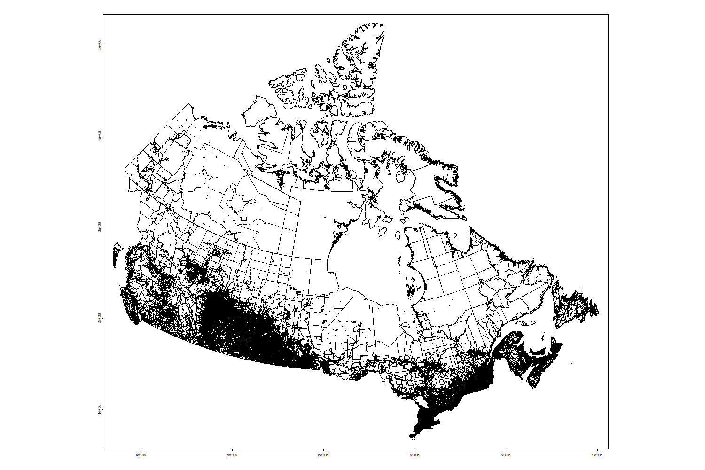


```{r eval=FALSE, echo=FALSE}
db_shp_temp <- db_shp
```

```{r eval=FALSE, echo=FALSE}
# make a new column for marking on map
all_prox_na$prox_na <- 1
```

```{r eval=FALSE, echo=FALSE}
# Merge DBUID column from all_prox_na to db_shp
all_prox <- all_prox_na %>% rename(DBID = DBUID)
all_prox <- all_prox[order(all_prox$DBID), ]
db_shp_temp <- merge(db_shp_temp, all_prox, by.x = c("DBUID"), by.y = c("DBID"), all.x = TRUE)
```


```{r echo=FALSE, eval=FALSE}
db_shp_temp
```

```{r eval=FALSE, echo=FALSE, dev = "png", dpi = 300}
plot(db_shp_temp, "prox_na")
```

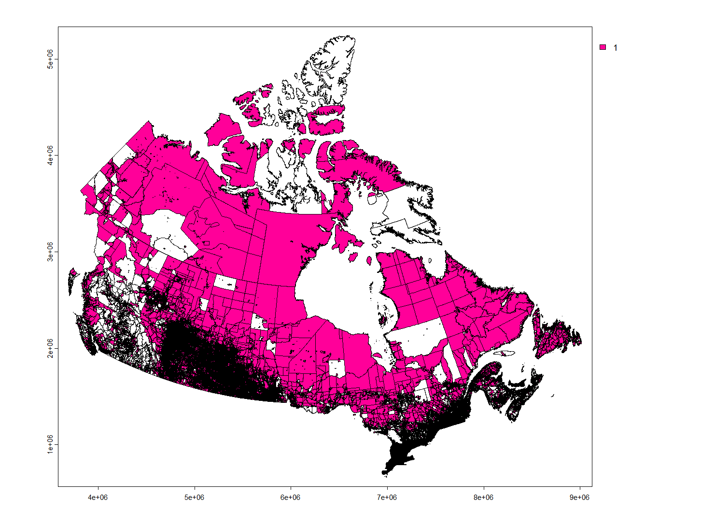

So where all proximity measures are missing are not randomly distributed. We have seen before that these areas have population. But our main target is to cluster the proximity measures. As all the proximity measures are missing here we can delete these rows from our database then do the clustering and also we can do clustering by keeping them aswell and see the difference.

```{r echo=FALSE, eval=FALSE}
z <- rast(db_shp_temp)
dim(z) <- c(4,4)
values(z) <- 1:16
names(z) <- "Zone"
# coerce SpatRaster to SpatVector polygons
z <- as.polygons(z)
z
```

Cut into 9 zones.

```{r eval=FALSE, echo=FALSE}
z2 <- z[2,]
plot(db_shp_temp)
plot(z, add=TRUE, border='blue', lwd=5)
plot(z2, add=TRUE, border='red', lwd=2, col='red')
```

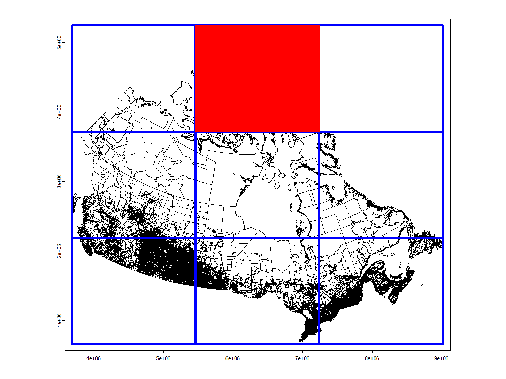

Left Lower portions of Canada

```{r eval=FALSE, echo=FALSE}
z7 <- z[7,]
i <- intersect(db_shp_temp, z7)
plot(i, "prox_na")
```

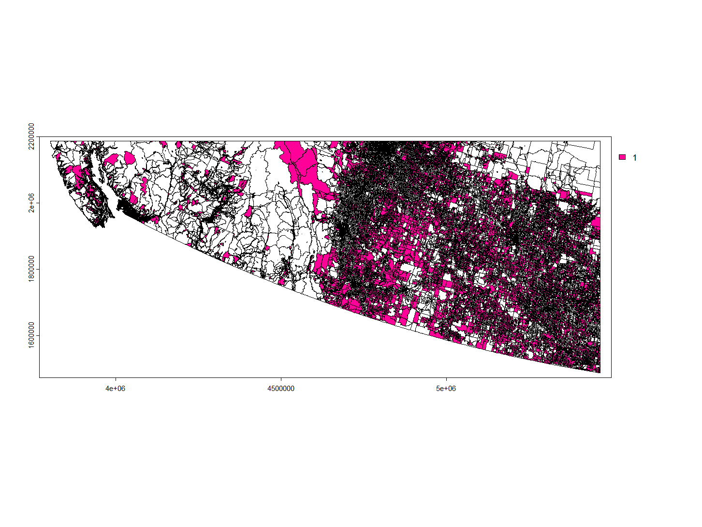

Provinces

```{r eval=FALSE, echo=FALSE}
# aggregate by province
pa <- aggregate(db_shp_temp, by="PRUID.x")
za <- aggregate(z)
```


```{r eval=FALSE, echo=FALSE}
plot(za, col="light gray", border="light gray", lwd=5)
plot(pa, add=TRUE, col=rainbow(13), lwd=3, border="white")
```

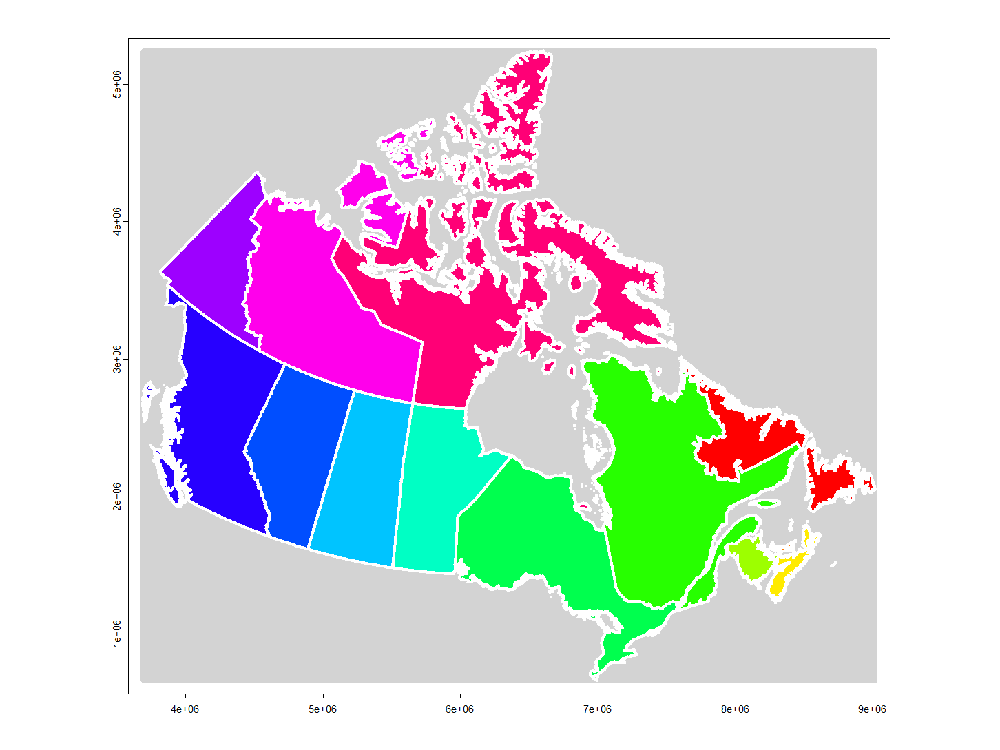

Closer look to all null proximity measures of BC.

```{r eval=FALSE, echo=FALSE}
# closer look to bc
i <- which(db_shp_temp$PRUID.x == 59)
pa_bc <- db_shp_temp[i,]
```

```{r eval=FALSE, echo=FALSE}
pa_bc
```


```{r eval=FALSE, echo=FALSE}
plot(pa_bc, "prox_na")
```

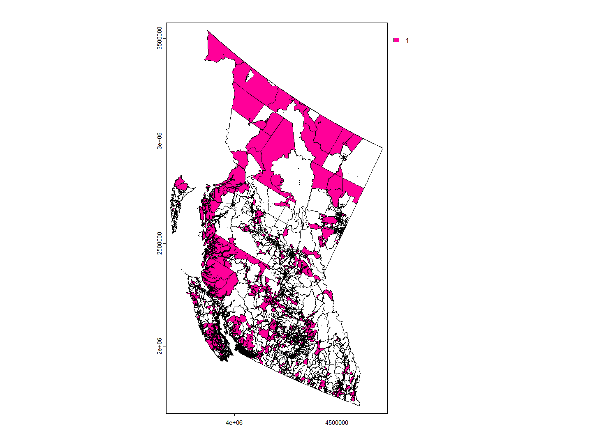

Closer look to all null proximity measures of Alberta.

```{r eval=FALSE, echo=FALSE}
# closer look to bc
i <- which(db_shp_temp$PRUID.x == 48)
pa_alberta <- db_shp_temp[i,]
```

```{r eval=FALSE, echo=FALSE}
plot(pa_alberta, "prox_na")
```

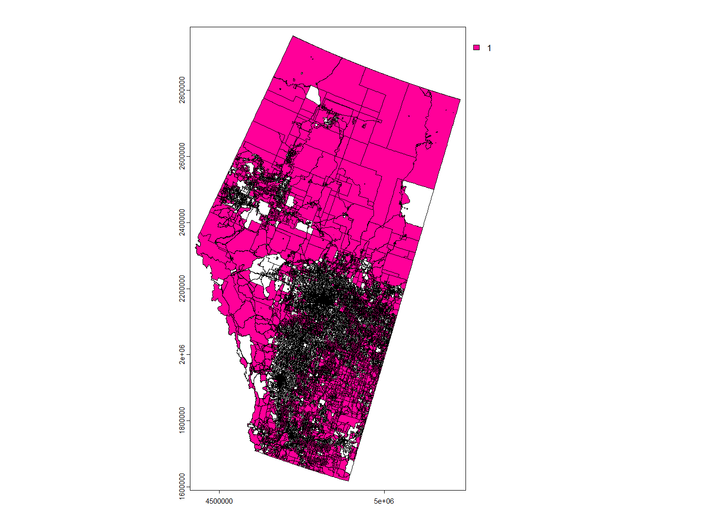

Closer look to all null proximity measures of Saskatchewan	

```{r eval=FALSE, echo=FALSE}
# closer look to bc
i <- which(db_shp_temp$PRUID.x == 47)
pa_saskatchewan <- db_shp_temp[i,]
```

```{r eval=FALSE, echo=FALSE}
plot(pa_saskatchewan, "prox_na")
```

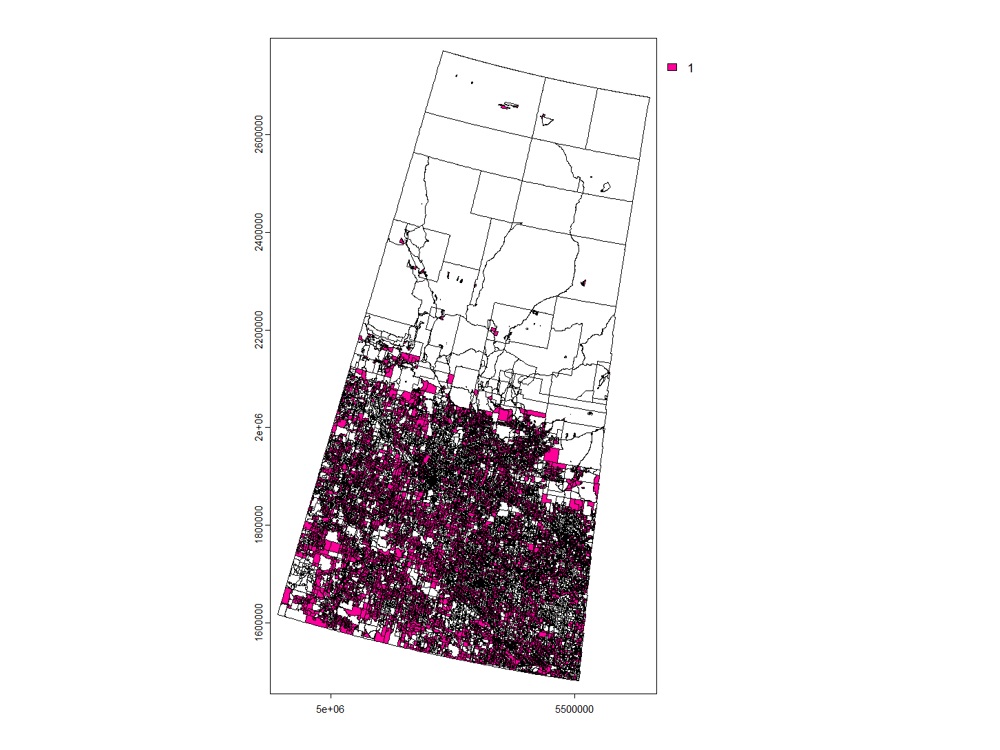

Closer look to all null proximity measures of Manitoba	

```{r eval=FALSE, echo=FALSE}
# closer look to bc
i <- which(db_shp_temp$PRUID.x == 46)
pa_manitoba <- db_shp_temp[i,]
```

```{r eval=FALSE, echo=FALSE}
plot(pa_manitoba, "prox_na")
```

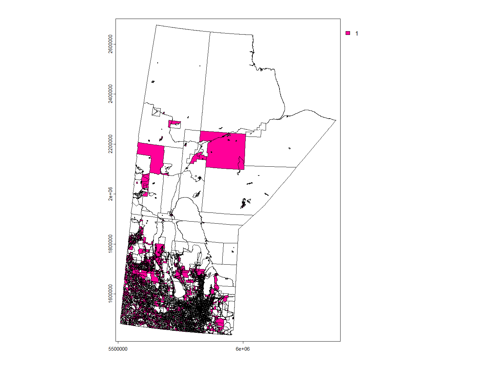

```{r echo=FALSE, eval=FALSE}
# 10	Newfoundland and Labrador / Terre-Neuve-et-Labrador
# 11	Prince Edward Island / Île-du-Prince-Édouard
# 12	Nova Scotia / Nouvelle-Écosse
# 13	New Brunswick / Nouveau-Brunswick
# 24	Quebec / Québec
# 35	Ontario
# 
# 
# 60	Yukon
# 61	Northwest Territories / Territoires du Nord-Ouest
# 62	Nunavut
```

Now let's look at the proximity measures na values aminity wise.

```{r eval=FALSE, echo=FALSE}
pmd_temp <- pmd
```

```{r eval=FALSE, echo=FALSE}
#prox_cols <- colnames(pmd)[grepl("^prox_idx", colnames(pmd))]

# Create a new column for each prox_col indicating if the value is missing
for (col in prox_cols) {
  pmd_temp[[paste0("prox_na_", col)]] <- ifelse(is.na(pmd_temp[[col]]), 1, 0)
}
```


```{r eval=FALSE, echo=FALSE}
# Subset the resulting columns
prox_na_cols <- colnames(pmd_temp)[grepl("^prox_na", colnames(pmd_temp))]
pmd_prox_na <- pmd_temp[, c("DBUID", prox_na_cols)]
```

```{r eval=FALSE, echo=FALSE,}
db_shp_temp <- db_shp
```

```{r eval=FALSE, echo=FALSE,}
# Merge DBUID column from pmd_prox_na to db_shp
pmd_prox <- pmd_prox_na %>% rename(DBID = DBUID)
pmd_prox <- pmd_prox[order(pmd_prox$DBID), ]
db_shp_temp <- merge(db_shp_temp, pmd_prox, by.x = c("DBUID"), by.y = c("DBID"), all.x = TRUE)
```

Let's look where grocery proximity measures are missing all over Canada.

```{r eval=FALSE, echo=FALSE, dev = "png", dpi = 300}
plot(db_shp_temp, "prox_na_prox_idx_grocery")
```

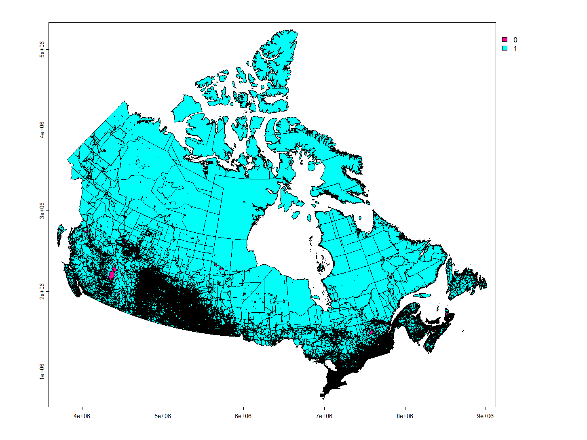


Closer look to null grocery proximity measures of BC	

```{r eval=FALSE, echo=FALSE}
# closer look to bc
i <- which(db_shp_temp$PRUID == 59)
pa_bc <- db_shp_temp[i,]
```

```{r eval=FALSE, echo=FALSE}
plot(pa_bc, "prox_na_prox_idx_grocery")
```

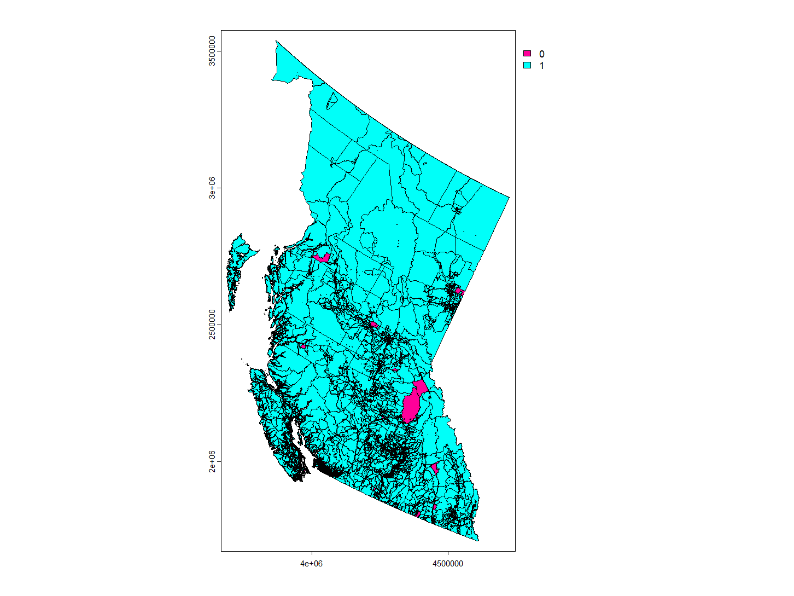


```{r}
# Count NAs and non-NAs in the grocery column where province is BC
sum(is.na(pmd$prox_idx_grocery[pmd$PRUID == 59]))
sum(!is.na(pmd$prox_idx_grocery[pmd$PRUID == 59]))
```

